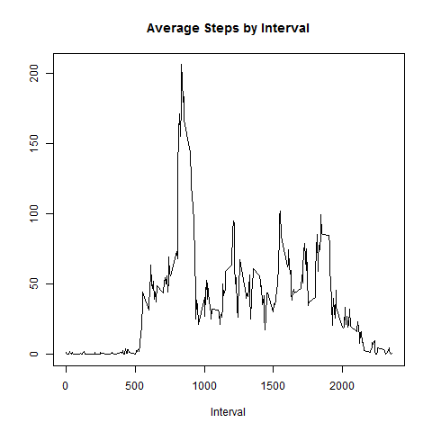

# Courser-Reproducible Research
JZ  
2017-01-26  


## R Markdown

Loading and preprocessing the data

Show any code that is needed to


```r
temp <- tempfile()
download.file("https://github.com/JZDataWorks/RepData_PeerAssessment1/raw/master/activity.zip",temp, mode="wb")
unzip(temp, "activity.csv")
activity <- read.csv("activity.csv", sep=",", header=T)
unlink(temp)

summary(activity)
```

```
##      steps                date          interval     
##  Min.   :  0.00   2012-10-01:  288   Min.   :   0.0  
##  1st Qu.:  0.00   2012-10-02:  288   1st Qu.: 588.8  
##  Median :  0.00   2012-10-03:  288   Median :1177.5  
##  Mean   : 37.38   2012-10-04:  288   Mean   :1177.5  
##  3rd Qu.: 12.00   2012-10-05:  288   3rd Qu.:1766.2  
##  Max.   :806.00   2012-10-06:  288   Max.   :2355.0  
##  NA's   :2304     (Other)   :15840
```

##What are mean total number of steps taken per day?

1. Calculate the total number of steps taken per day
2. Make a histogram of the total number of steps taken each day
3. Calculate and report the mean and median of the total number of steps taken per day


```r
stepsbydate<-aggregate(activity$steps,by=list(activity$date),ignore.na=TRUE,FUN="sum")
names(stepsbydate)<-c("Dates","Steps")

#1. 
sum(stepsbydate$Steps,na.rm=TRUE)
```

```
## [1] 570661
```

```r
#2. 
hist(stepsbydate$Steps)
```

<!-- -->

```r
#3
median(stepsbydate$Steps,na.rm=TRUE)
```

```
## [1] 10766
```

```r
mean(stepsbydate$Steps,na.rm=TRUE)
```

```
## [1] 10767.19
```

##What is the average daily activity pattern?

1. Make a time series plot (i.e. type = "l") of the 5-minute interval (x-axis) and the average number of steps taken, averaged across all days (y-axis)
2. Which 5-minute interval, on average across all the days in the dataset, contains the maximum number of steps?


```r
#1 
stepsbyinterval<-aggregate(activity$steps,by=list(activity$interval),na.rm=TRUE,FUN="mean")
names(stepsbyinterval)<-c("Interval","Steps")

plot(y=stepsbyinterval$Steps,x=stepsbyinterval$Interval,type="l",xlab="Interval", ylab="",main="Average Steps by Interval")
```

<!-- -->

```r
#2
stepsbyinterval<-stepsbyinterval[order(-stepsbyinterval$Steps),]
head(stepsbyinterval)
```

```
##     Interval    Steps
## 104      835 206.1698
## 105      840 195.9245
## 107      850 183.3962
## 106      845 179.5660
## 103      830 177.3019
## 101      820 171.1509
```


Imputing missing values

Note that there are a number of days/intervals where there are missing values (coded as NA). The presence of missing days may introduce bias into some calculations or summaries of the data.

1. Calculate and report the total number of missing values in the dataset (i.e. the total number of rows with NAs)
2. Devise a strategy for filling in all of the missing values in the dataset. The strategy does not need to be sophisticated. For example, you could use the mean/median for that day, or the mean for that 5-minute interval, etc.
3. Create a new dataset that is equal to the original dataset but with the missing data filled in.
4. Make a histogram of the total number of steps taken each day and Calculate and report the mean and median total number of steps taken per day. Do these values differ from the estimates from the first part of the assignment? What is the impact of imputing missing data on the estimates of the total daily number of steps?


```r
#1
sum(is.na(activity$steps))
```

```
## [1] 2304
```

```r
#2 How to fill NAs - 
  # First- Find medians by each interval 
  # Second -  Make a new column in the activity dataset through merging
  # Last - Test for NA's in the Steps variable and replace with the median value from the new coulumn 

#3 Creat new dataset 
medianstepsbyinterval<-aggregate(activity$steps,by=list(activity$interval),na.rm=TRUE,FUN="median")
names(medianstepsbyinterval)<-c("interval","mediansteps")
newactivity<-merge(activity,medianstepsbyinterval)
newactivity$stepsnafill<-ifelse(!is.na(newactivity$steps),newactivity$steps,newactivity$mediansteps)

#4

stepsbydatenona<-aggregate(newactivity$stepsnafill,by=list(newactivity$date),ignore.na=TRUE,FUN="sum")
names(stepsbydatenona)<-c("Dates","Steps_No_NA")

hist(stepsbydatenona$Steps_No_NA)
```

<!-- -->

```r
#NA's Removed
median(stepsbydatenona$Steps_No_NA)
```

```
## [1] 10396
```

```r
mean(stepsbydatenona$Steps_No_NA)
```

```
## [1] 9504.869
```

```r
#Original
median(stepsbydate$Steps,na.rm=TRUE)
```

```
## [1] 10766
```

```r
mean(stepsbydate$Steps,na.rm=TRUE)
```

```
## [1] 10767.19
```

Are there differences in activity patterns between weekdays and weekends?

1.  a new factor variable in the dataset with two levels - "weekday" and "weekend" indicating whether a given date is a weekday or weekend day.
2. Make a panel plot containing a time series plot (i.e. type = "l") of the 5-minute interval (x-axis) and the average number of steps taken, averaged across all weekday days or weekend days (y-axis). See the README file in the GitHub repository to see an example of what this plot should look like using simulated data.


```r
#1
activity$date<-as.Date(activity$date)
activity$day<-weekdays(activity$date)
activity$weekday<-ifelse(activity$day==c("Saturday","Sunday"),"Weekend","Weekday")
activity$weekday<-as.factor(activity$weekday)

#2

library(lattice)
weekdaystepsbyinterval<-aggregate(activity$steps,by=list(activity$interval,activity$weekday),na.rm=TRUE,FUN="mean")
names(weekdaystepsbyinterval)<-c("Interval","Weekday","Steps")

xyplot(Steps ~ Interval | Weekday, weekdaystepsbyinterval, type ="l", grid="h", main="Average Steps per Interval by Weekend and Weekday")
```

<!-- -->

